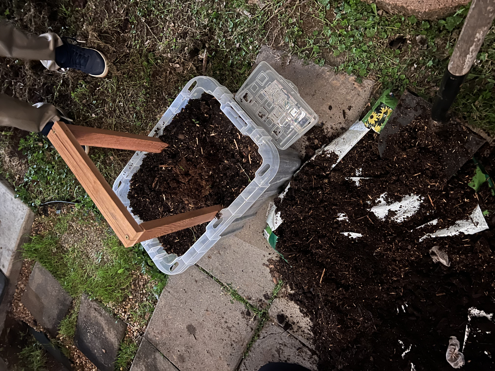
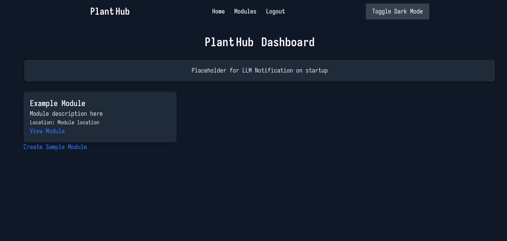
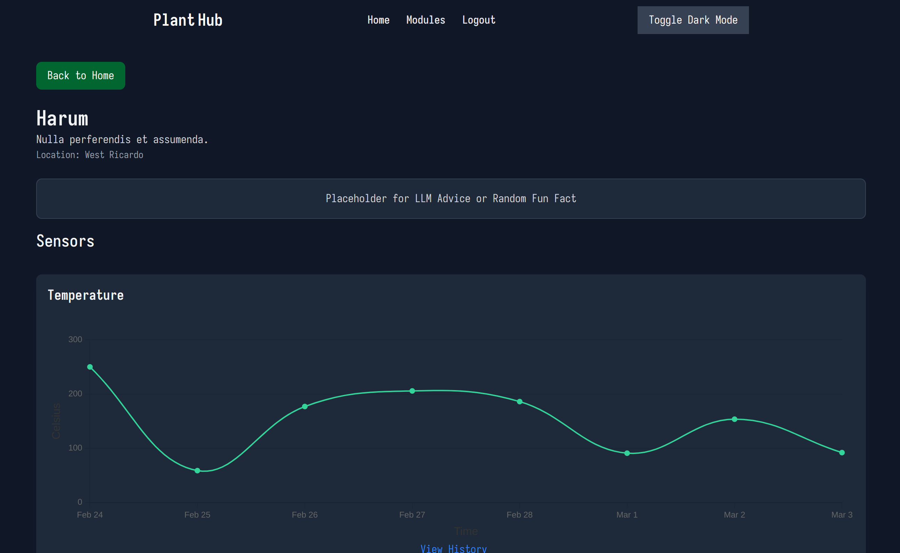

# Individual Weekly Report

**Name**: Caden Miller

**Team**: Plantir

**Date**: 03/03/25

## Current Status

### What did _you_ work on this past week?

| Task | Status | Time Spent | 
| ---- | ------ | ---------- |
|Helped construct pot|Partially complete|3hr|
|Website UI|Complete|2hr|

### What problems did you run into? What is your plan for them?
3D print was going to take way too long, so we ended up just building our own pot.
Grow light requires a relay and external power source.

### What is the current overall project status from your perspective? 
It is fairly good, we need to present a working demo of the pot by next demo though. Showing lighting, watering, etc.

### How is your team functioning from your perspective?
The team is functioning well, we are getting into a good rhythm.

### What new ideas did you have or skills did you develop this week?
Assembly with carpentry (?) and more UI experience via CSS and Stimulus with Rails.

### Who was your most awesome team member this week and why?
Mihir was the most awesome teammate as he did most of the assembly of the pot and that was a great help

## Plans for Next Week
I will work on the software side of things to get the data views to be modifiable by time.
