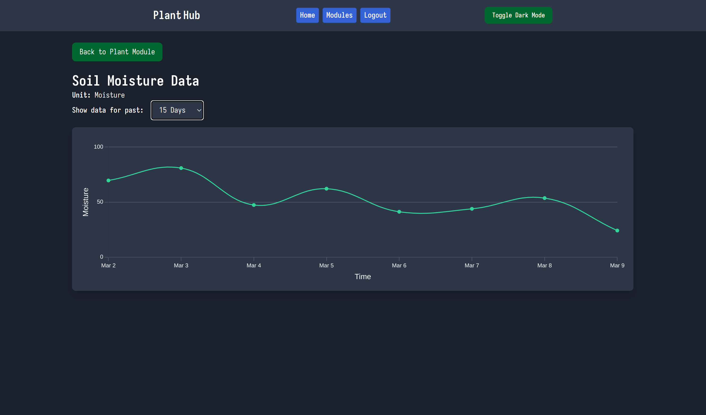
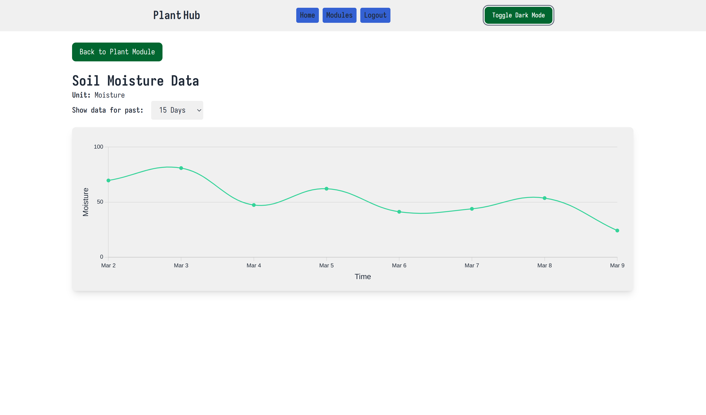
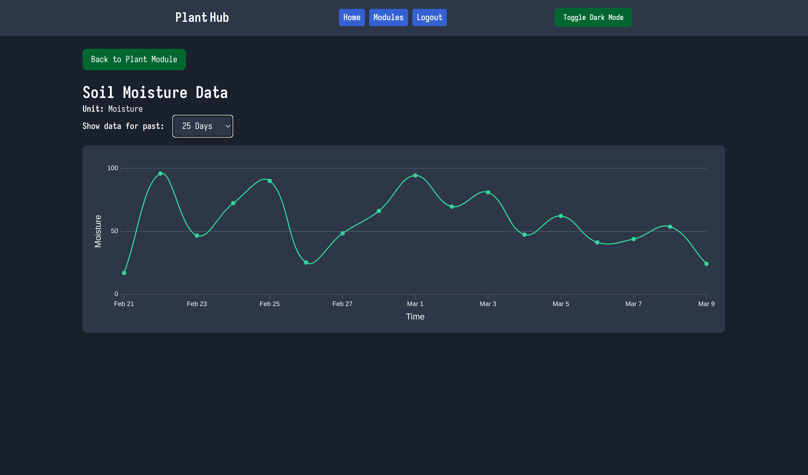

# Individual Weekly Report

**Name**: Caden Miller

**Team**: Plantir

**Date**: 03-17-2025

## Current Status

### What did _you_ work on this past week?

| Task | Status | Time Spent | 
| ---- | ------ | ---------- |
|Added data views to website i.e. can view 5 days, 10 days, etc.|Complete|2hrs|
|Dark mode on website|Complete|2hrs|

### What problems did you run into? What is your plan for them?

Some of the stylings got messed up by updating the light mode and dark mode but I will fix this with just another comb through of the css and the website.

### What is the current overall project status from your perspective? 

The project status is decent - we need to deliver a working product next week though and right now we still need to address the grow light and the watering mechanism. We seem to be making progress in this regard but it has been slow

### How is your team functioning from your perspective?

The team is functioning well, but I think we need to communicate more to make sure we are delivering everything that we need to.

### What new ideas did you have or skills did you develop this week?

I developed my CSS skills and my Rails skills. Furthermore, I have continued to garden on the side for fun gaining more knowledge there. 

### Who was your most awesome team member this week and why?

Alex was my most awesome team member as he started working on the relay to connect with the grow lights and watering pump. 

## Plans for Next Week

I am going to work on the hardware as we need to really focus on the hardware and its interface in order to deliver a working product.

