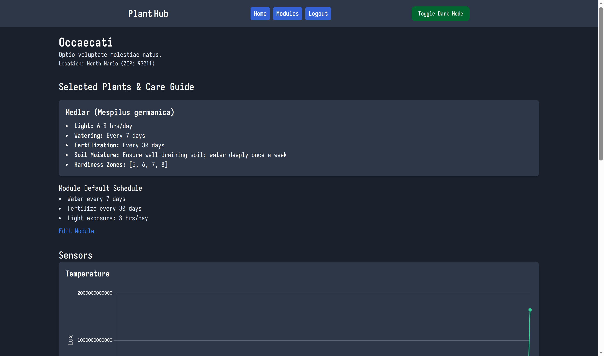
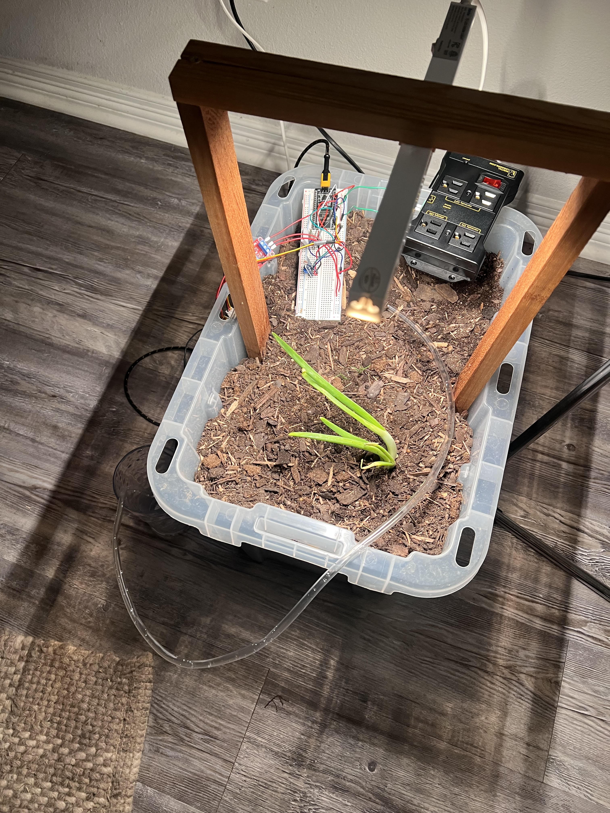

# Individual Weekly Report

**Name**: Caden Miller

**Team**: Plantir

**Date**: 03/24/25

## Current Status

### What did _you_ work on this past week?

| Task | Status | Time Spent | 
| ---- | ------ | ---------- |
|Data views by day|Complete|2hrs|
|Updated website UI|As complete as I can be (its UI)|3hrs|
|Integration of ESP32 and Rails|Partially complete|5hrs|
|Making it so that a plant database is integrated with the website|Partially complete|2hrs|

### What problems did you run into? What is your plan for them?
The plant recommendation is a little buggy and the scheduling is yet to be completed for lighting, watering, etc. The plan is to fix the plant recommendation and have that create schedules for the plant module setup which will be modifiable by the user.

### What is the current overall project status from your perspective? 
The overall status is good, we are progressing on pace. The integration this week was a big deal and we got it working which is great news.

### How is your team functioning from your perspective?
The team is coming together and functioning well - we are all working well together to get this thing done on time.

### What new ideas did you have or skills did you develop this week?
I worked more with the relays which was very cool, have made progress with Rails and Stimulus, and finally have done a lot of gardening.

### Who was your most awesome team member this week and why?
Mihir was the most awesome team member as he locked in at my house and stayed up late with me working on the integration of the project which was much needed and super helpful. Together we got the project in a good working state. 

## Plans for Next Week

Next week I plan to work on the scheduling of water, lighting, etc. and get that all working with the microcontroller.
