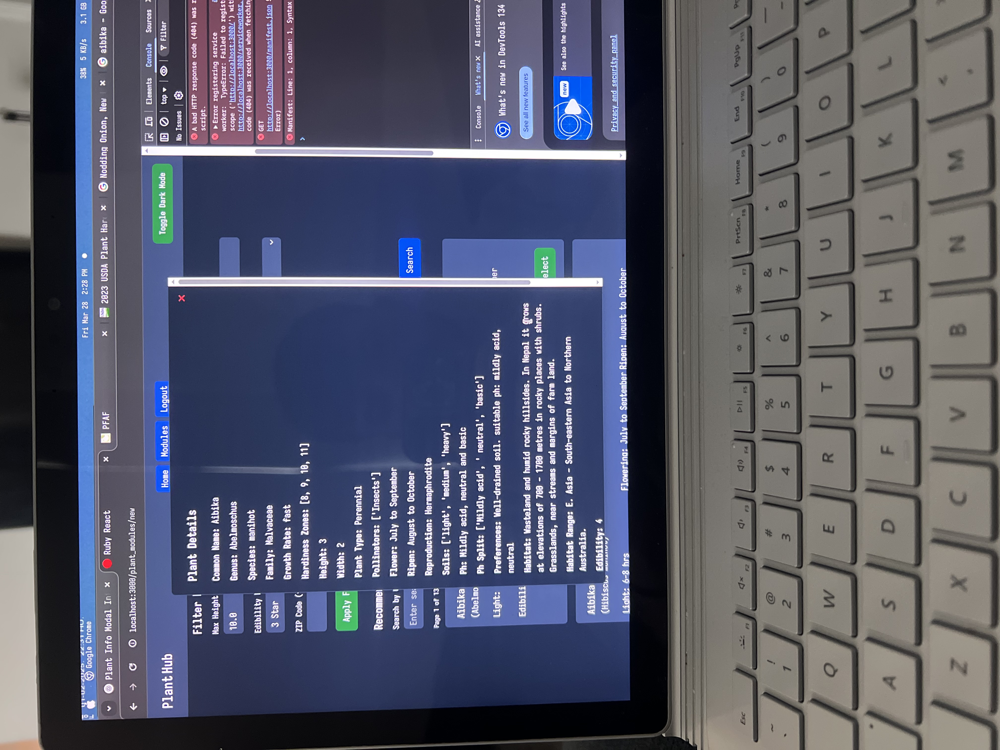
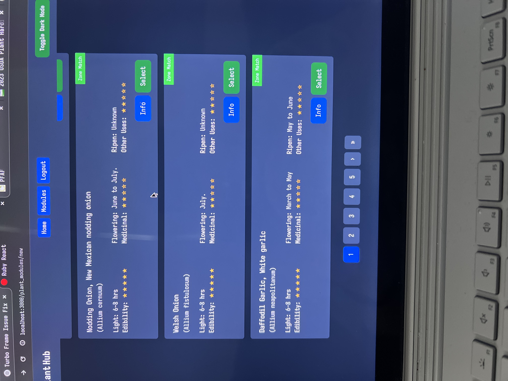
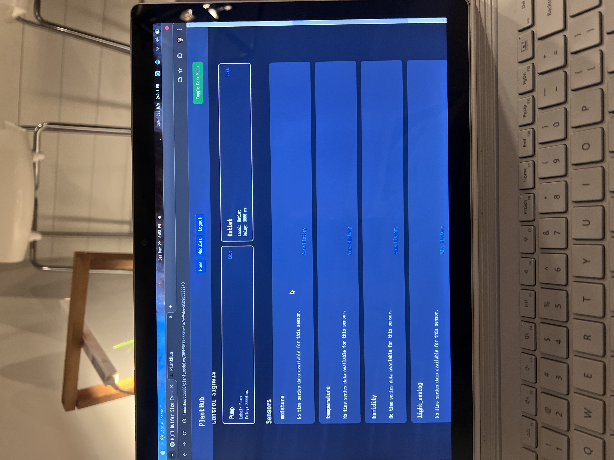

# Individual Weekly Report

**Name**: Caden Miller

**Team**: Plantir

**Date**: 03-31-2025

## Current Status

### What did _you_ work on this past week?

| Task | Status | Time Spent | 
| ---- | ------ | ---------- |
|Easier setup|Partially complete|4 hours|
|Full in-soil system set up (i.e. hardware works fully and together, all soldered)|Complete|4 hours|
|Notifications|Partially complete|2 hours|
|Hydroponic system design|Partially compelte|2 hours|
|Upgraded plant database (900 -> 5000 entries)|Complete|1 hour|

### What problems did you run into? What is your plan for them?
Setting up the notifications was difficult as my access to the Google cloud console is nonexistent, but peer programming will fix this issue.

### What is the current overall project status from your perspective? 
The status is looking great we are making a ton of progress on all fronts.

### How is your team functioning from your perspective?
The team is functioning well

### What new ideas did you have or skills did you develop this week?
A lot of integration and front-end work as well as some back-end work.

### Who was your most awesome team member this week and why?
My most awesome team member was Alex as he is working diligently on getting the camera working.

## Plans for Next Week
I am planning to integrate the lighting system with the care schedules as of right now just the watering is.

