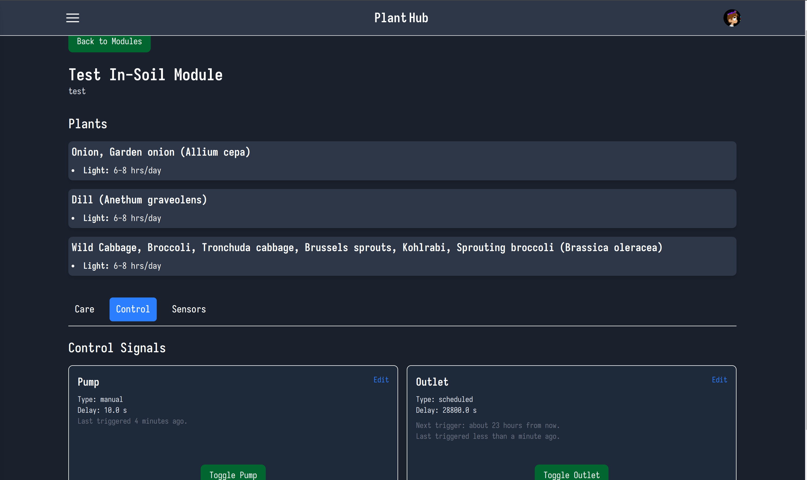
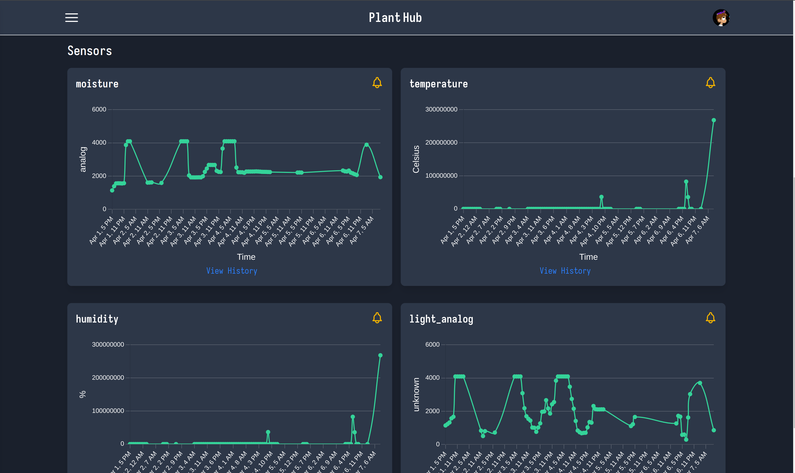
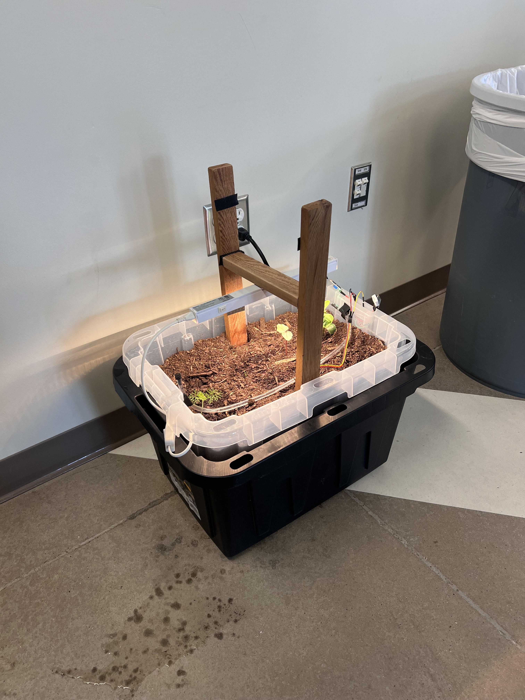

# Individual Weekly Report

**Name**: Caden Miller

**Team**: Plantir

**Date**: 04-07-2025

## Current Status

### What did _you_ work on this past week?

| Task | Status | Time Spent | 
| ---- | ------ | ---------- |
|Control signal toggles|Complete|2 hours|
|Scheduling of control signals|Complete|3 hours|
|UI updates|Partially complete|2 hours|

### What problems did you run into? What is your plan for them?
The notifications were a little hard to setup and push notifications still need to be added. Furthermore, the scheduling matching with a proposed care schedule could use some improvement. I plan to continue working through these issues to get a solid final product. 

### What is the current overall project status from your perspective? 
The project is in a good state - we need to finish the hydroponic garden.

### How is your team functioning from your perspective?
The team is functioning well - more work is needed but I think everyone will contribute from here.

### What new ideas did you have or skills did you develop this week?
I have done a ton of work with MQTT and general Rails work as well.

### Who was your most awesome team member this week and why?
My most awesome team member was Mihir because he came over this weekend and worked a lot on refining the in-soil plant module. 

## Plans for Next Week
My plans for next week are primarily to continue woring on the software and also help with the hardware of the hydroponic module.
