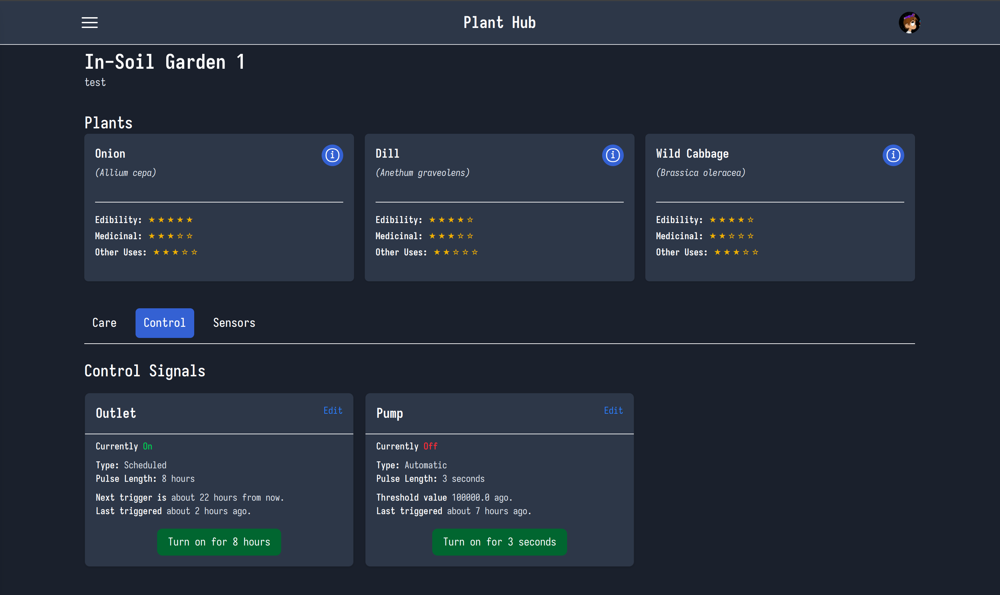
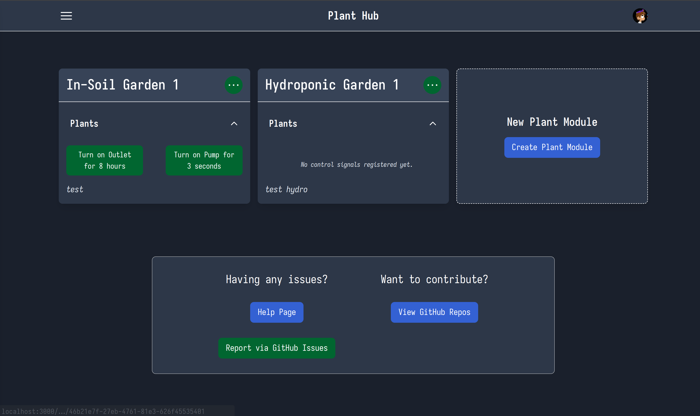

# Individual Weekly Report

**Name**: Caden Miller

**Team**: Plantir

**Date**: 04/14/2025

## Current Status

### What did _you_ work on this past week?

| Task | Status | Time Spent | 
| ---- | ------ | ---------- |
|A lot of logic work on the Rails side so that states are persistent even if power is disconnected from the ESP32|Complete|Too much|
|Visual updates across the site for usability|Complete|6hrs|
|User studies|Partially complete|3hrs|

### What problems did you run into? What is your plan for them?

I ran into an issue when trying to get the persistence of signals working and I had no idea how to fix it, but Mihir was able to spot the error and fix it (the outlet relay was faulty).

### What is the current overall project status from your perspective? 

The project is in a great state especially since we can't bring our hydroponic garden to the showcases so it is much more focused on the in-soil. 

### How is your team functioning from your perspective?

The team is functioning well - everyone has theor own task and we are all working simulatenously.

### What new ideas did you have or skills did you develop this week?

I have developed a lot of front-end skills and also have worked extensively with the MQTT side of things.

### Who was your most awesome team member this week and why?

Mihir was my most awesome team member as he came over and worked a lot on the project with me. We have big ideas and ae able to talk about them reasonably together.

## Plans for Next Week

I will work on the presentation and then any final touches on the site. 
