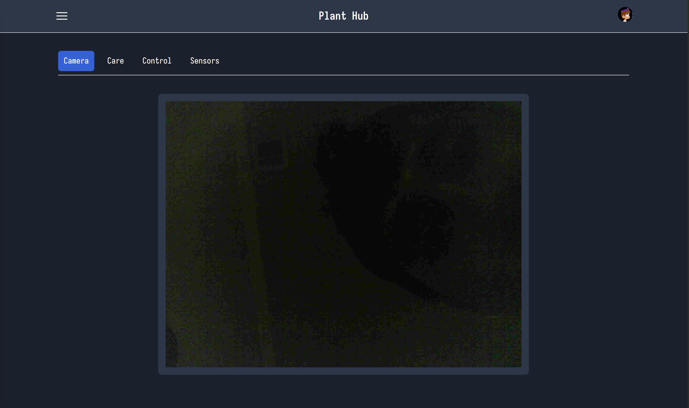

# Individual Weekly Report

**Name**: Caden Miller

**Team**: Plantir

**Date**: 04/21/2025

## Current Status

### What did _you_ work on this past week?

| Task | Status | Time Spent | 
| ---- | ------ | ---------- |
|RSpec Testing|Partially complete|1hr|
|Miscellaneous expo stuff|Complete|1hr|
|Small UI changes|Complete|30min|

### What problems did you run into? What is your plan for them?
I ran into the problem of WiFi and MQTT being intermittent. My plan is to test the other ESP32 and determine whether this fixes the connectivity issues or not. Furthermore, getting a photo to render as a timelapse has yet to be done.

### What is the current overall project status from your perspective? 
Overally our project is in a great state, ideally we are able to get the demo working on campus so that we can display the click to toggle the lights at EPS.

### How is your team functioning from your perspective?
The team is functioning well and demoing well together. Ideally we are able to fix the camera and get a full, working demo for EPS. 

### What new ideas did you have or skills did you develop this week?
Further work with RSpec, writing, and frontend skills.

### Who was your most awesome team member this week and why?
Mihir was my most awesome team member because he was constantly working on the hardware and making sure the demo was smooth sailing.

## Plans for Next Week
Ideally we will be able to have a functional demo by EPS and hopefully also include the camera feature to some extent.
