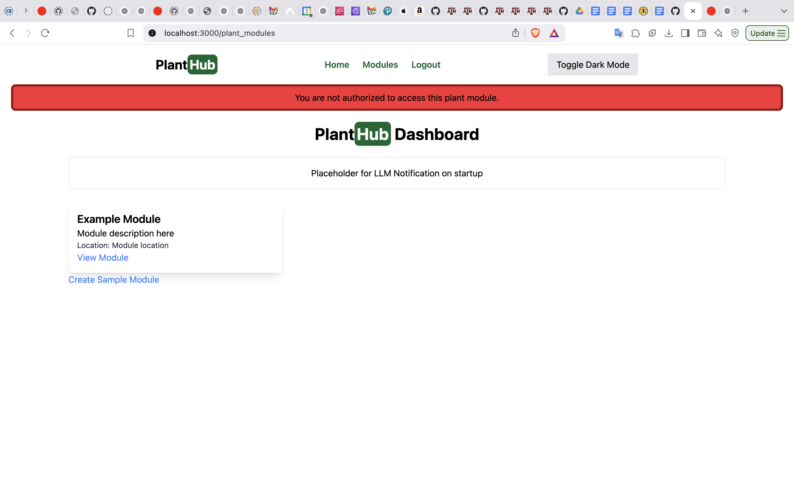

# Individual Weekly Report

**Name**: Kevin Johnson

**Team**: Plantir

**Date**: 03/03/25

## Current Status

We are working successfully to finish a working version of the proejct on time.

### What did _you_ work on this past week?

| Task | Status | Time Spent | 
| ---- | ------ | ---------- |
|   Set up frontend connection to water   |   complete     |       1 hour     |
|  Set up authentication that only allows users to modify their own plant modules    |   complete     |      1 hour      |
|      |        |            |

*Include screenshots/diagrams/figures/etc. to illustrate what you did this past week.*

### What problems did you run into? What is your plan for them?

### What is the current overall project status from your perspective? 

### How is your team functioning from your perspective?

### What new ideas did you have or skills did you develop this week?

### Who was your most awesome team member this week and why?

## Plans for Next Week

*What are you going to work on this week?*
