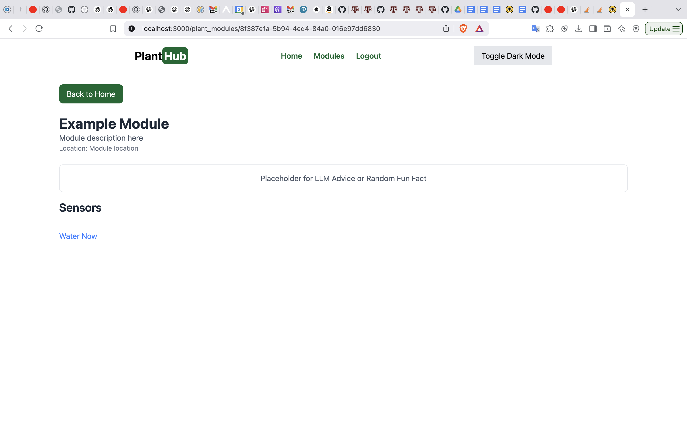

# Individual Weekly Report

**Name**: Kevin Johnson

**Team**: Plantir

**Date**: 03/03/25

## Current Status

We are working successfully to finish a working version of the proejct on time.

### What did _you_ work on this past week?

| Task | Status | Time Spent | 
| ---- | ------ | ---------- |
|   Set up frontend connection to water   |   complete     |       1 hour     |
|  Set up authentication that only allows users to modify their own plant modules    |   complete     |      1 hour      |
|      |        |            |

*Include screenshots/diagrams/figures/etc. to illustrate what you did this past week.*

*When accessing a plant module that doesn't belong to the user, they are redirected with an error flash.*

*Users have access to a water now button sends a message to an mqtt server that the module is connected to,*

### What problems did you run into? What is your plan for them?

I ran into some issues when testing my watering feature - because our seeding data generates plant modules with random users
when my authentication limited the modules that the user can see to what the user already has, nothing appeared. Thus, I created
a quick test create function that created a dummy module owned by the user that I can use for testing.

### What is the current overall project status from your perspective? 

I think we are making good progress and are on pace to complete it on time.

### How is your team functioning from your perspective?

I think we are all working well together.

### What new ideas did you have or skills did you develop this week?

I developed better ruby on rails skills and intuition.

### Who was your most awesome team member this week and why?

My most awesome team member this week was Caden for his contributions in building the hardware.

## Plans for Next Week

*What are you going to work on this week?*

I plan on helping with the hardware connection and then ensuring that the sensors can load data into the database.
Hopefully, we can start working on the water pump as well.
