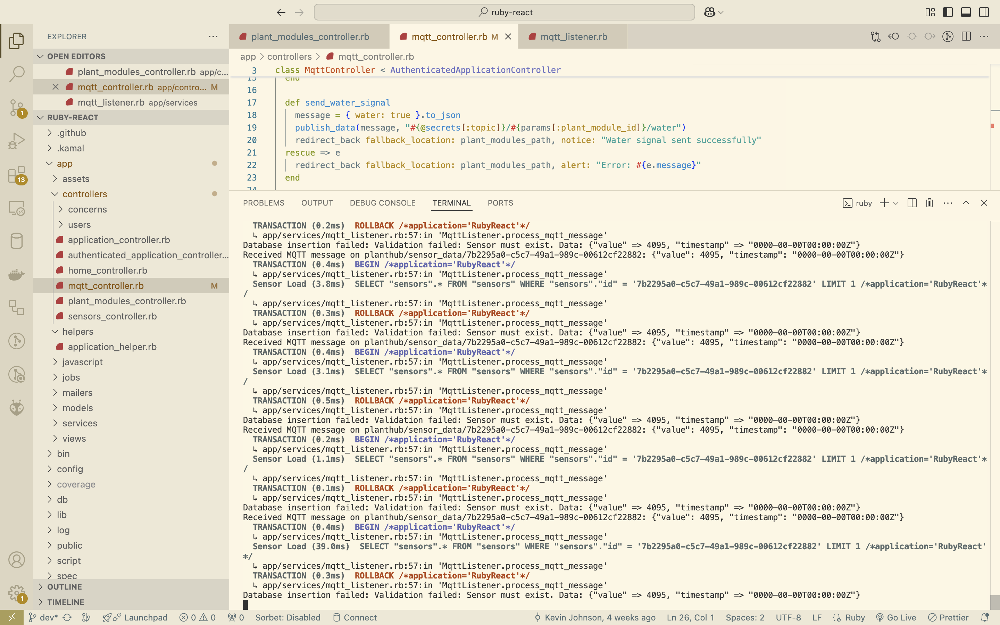
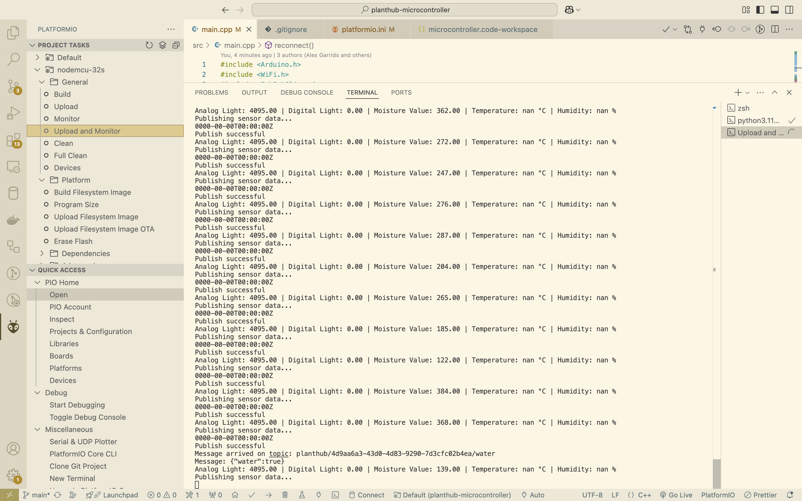

# Individual Weekly Report

**Name**: Kevin Johnson

**Team**: Plantir

**Date**: 03/17/25

## Current Status

We are working well to finish a present a good first demo by next Monday.

### What did _you_ work on this past week?

| Task | Status | Time Spent | 
| ---- | ------ | ---------- |
|  Confirm ability to send messages between server and IoT device   |   complete     |   2 hours  |
|      |        |            |

*Include screenshots/diagrams/figures/etc. to illustrate what you did this past week.*

*Rails server now listens to sensor information sent from IoT device and can put them in database given correct sensor id*

*IOT device sends sensor information and listens to commands from mqtt server*

### What problems did you run into? What is your plan for them?

We ran into some issues regarding SSL certification when connecting to the MQTT server through the IoT device
and had to switch to a server that didn't utilize it.

### What is the current overall project status from your perspective? 

I think we are making good progress and are on pace to give a good demo on Monday as well as complete it.

### How is your team functioning from your perspective?

I think we are all working well together.

### What new ideas did you have or skills did you develop this week?

I developed better skills regarding managing MQTT connections.

### Who was your most awesome team member this week and why?

My most awesome team member this week was Mihir for his contributions in building the hardware.

## Plans for Next Week

*What are you going to work on this week?*

I plan on helping with the software and helping with integrations whenver possible.
