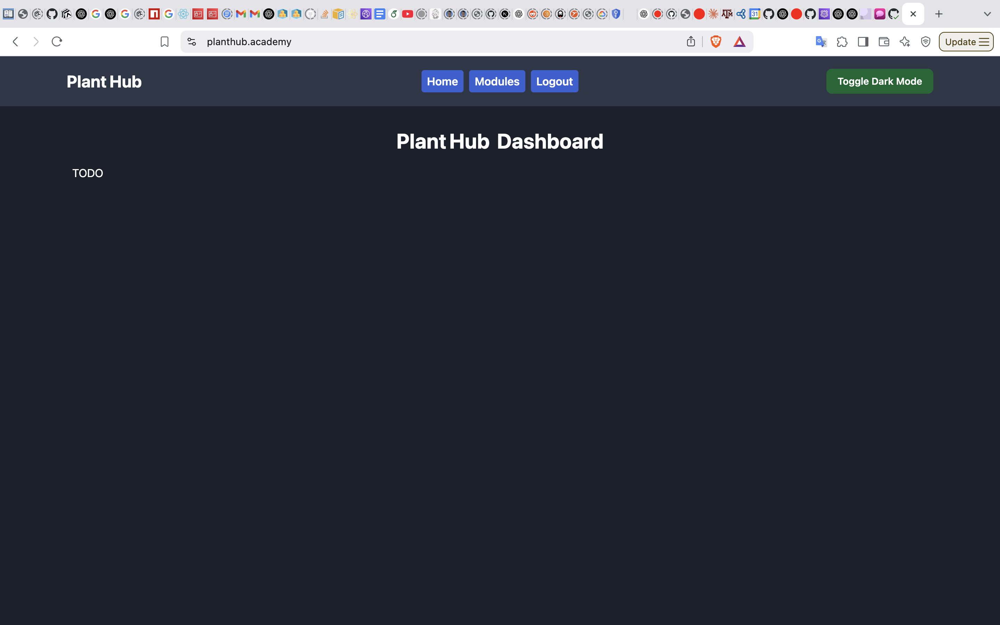
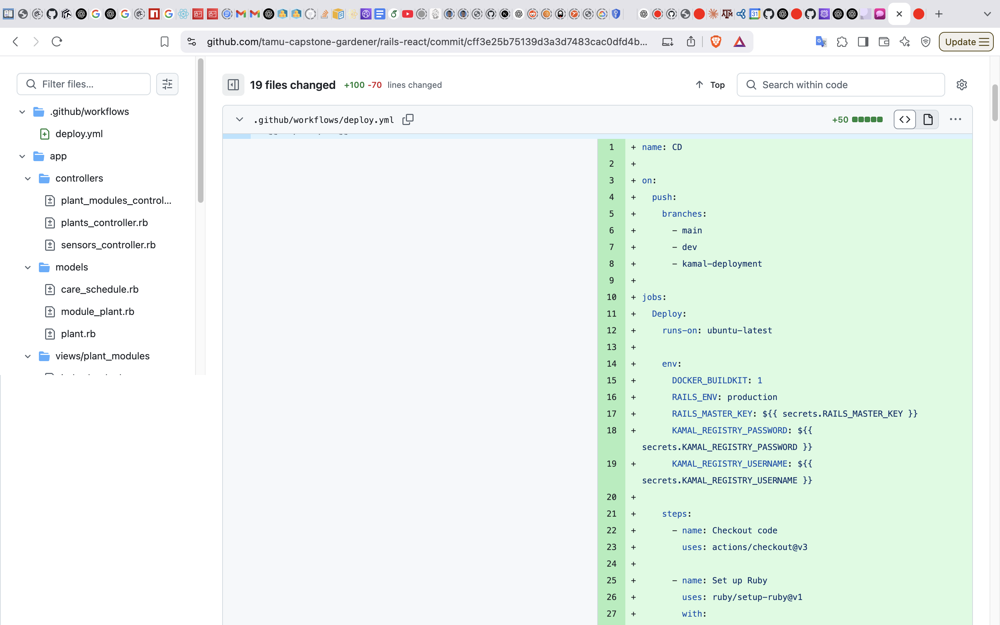
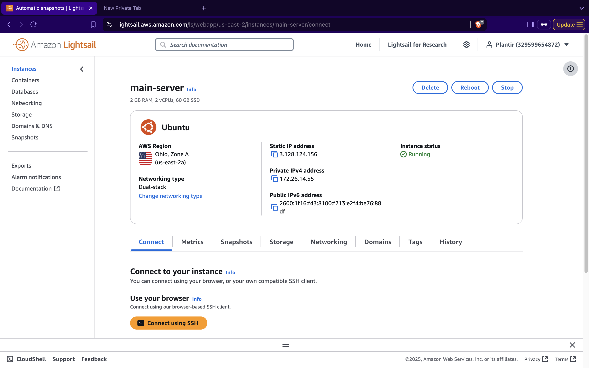

# Individual Weekly Report

**Name**: Kevin Johnson

**Team**: Plantir

**Date**: 03/17/25

## Current Status

We are working well to finish up our project and have it be deployed successfully.

### What did _you_ work on this past week?

| Task | Status | Time Spent | 
| ---- | ------ | ---------- |
|  Obtained `planthub.academy` domain and successfully deployed to it   |   complete     |   4 hours  |
|      |        |            |

*Include screenshots/diagrams/figures/etc. to illustrate what you did this past week.*

*Website accessible from `planthub.academy`*

*CD file that autodeploys*

*Lightsail instance running*

### What problems did you run into? What is your plan for them?

I ran into issues figuring out all the logistics behind manual deployment.

### What is the current overall project status from your perspective? 

I think we are making good progress and are on pace to finish up our project with all our original goals.

### How is your team functioning from your perspective?

I think we are all working well together.

### What new ideas did you have or skills did you develop this week?

I got a better idea of all the complexity that deployment takes.

### Who was your most awesome team member this week and why?

My most awesome team member this week was Mihir for his contributions in helping ensure that our product works seamlessly.

## Plans for Next Week

*What are you going to work on this week?*

I plan on helping with the software and helping with integrations whenver possible.
