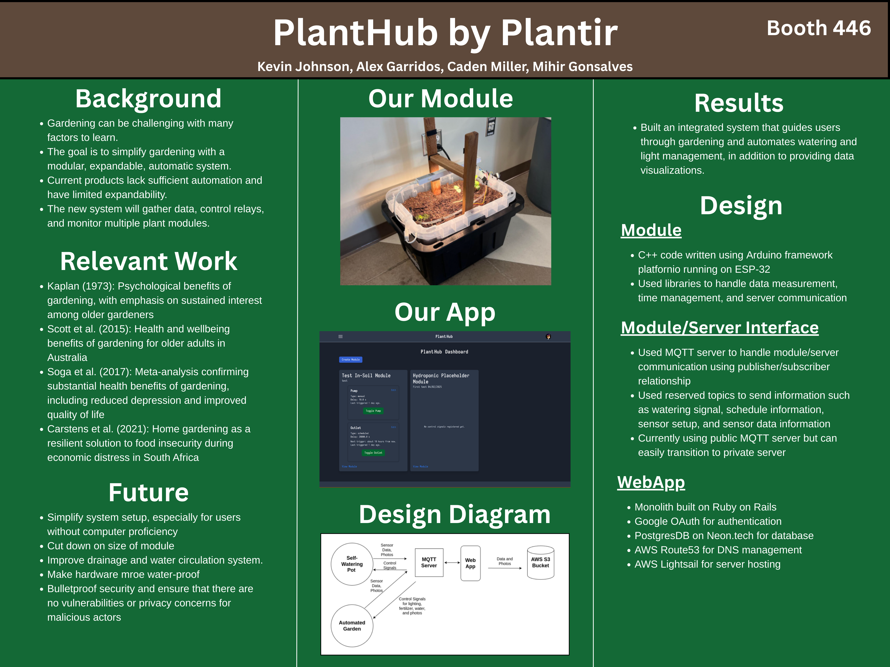

# Individual Weekly Report

**Name**: Kevin Johnson

**Team**: Plantir

**Date**: 04/14/25

## Current Status

We are working to finish up work for the hydroponic module, as well as making preparations for our upcoming Capstone presentations.

### What did _you_ work on this past week?

| Task | Status | Time Spent | 
| ---- | ------ | ---------- |
|  Capstone Poster  |   complete     |   2 hours  |

*Include screenshots/diagrams/figures/etc. to illustrate what you did this past week.*

*Capstone Poster Iteration 2*

### What problems did you run into? What is your plan for them?

I ran into issues regarding the layout of the poster and ensuring the design is good. I researched through old files from earlier to find
the information I needed.

### What is the current overall project status from your perspective? 

I think we are making good progress and are on pace to finish up our project with all our original goals.

### How is your team functioning from your perspective?

I think we are all working well together.

### What new ideas did you have or skills did you develop this week?

I got a better idea of making beautiful designs through Canva.

### Who was your most awesome team member this week and why?

My most awesome team member this week was Alex for his contributions in building the camera module.

## Plans for Next Week

*What are you going to work on this week?*

I plan on helping upload files from the camera module.
