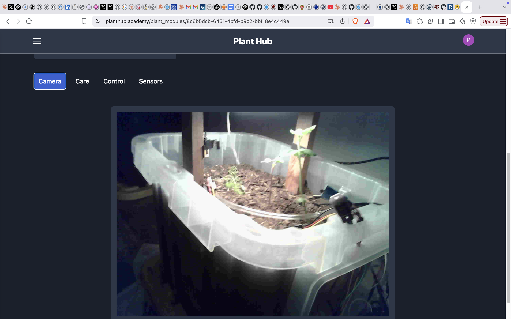

# Individual Weekly Report

**Name**: Kevin Johnson

**Team**: Plantir

**Date**: 04/21/25

## Current Status

We are working to finish final work for the presentation.

### What did _you_ work on this past week?

| Task | Status | Time Spent | 
| ---- | ------ | ---------- |
|  Photo Module  |   complete     |   2 hours  |
|  Deployment and Database Synchronization for Presentation  |   complete     |   2 hours  |

*Include screenshots/diagrams/figures/etc. to illustrate what you did this past week.*

*Live Photo in Planthub*

### What problems did you run into? What is your plan for them?

I ran into some issues ensuring that the database copy we made would work seamlessly with the state of ruby migrations.

### What is the current overall project status from your perspective? 

I think we are making good progress and are on pace to finish up our project with all our original goals.

### How is your team functioning from your perspective?

I think we are all working well together.

### What new ideas did you have or skills did you develop this week?

I got good experience working with ActiveStorage in Ruby on Rails, as well as more experience syncing up databases and working with
postgresql dump files.

### Who was your most awesome team member this week and why?

My most awesome team member this week was Caden for contributions in ensuring that all our features are deployed correctly.

## Plans for Next Week

*What are you going to work on this week?*

I plan on trying to switch to our personal MQTT server.
