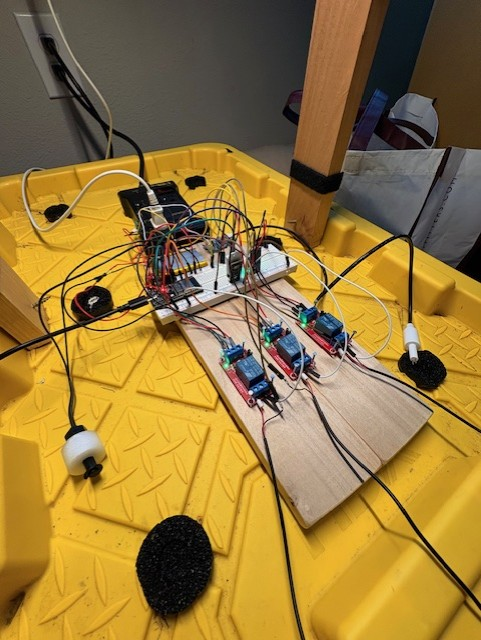
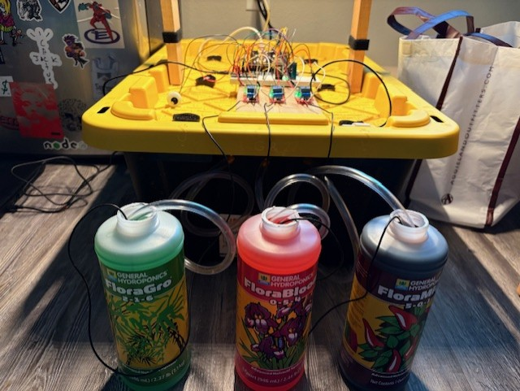

# Individual Weekly Report

**Name**: Mihir Gonsalves

**Team**: Plantir

**Date**: 04/21/2025

## Current Status

### What did _you_ work on this past week?

| Task | Status | Time Spent | 
| ---- | ------ | ---------- |
|   Build Hydroponic Garden   |    Complete    |      3 hours      |
|   CSE Showcase   |    Complete    |      2 hours      |
|   Camera functionality   |    In progress    |      2 hours      |

*Include screenshots/diagrams/figures/etc. to illustrate what you did this past week.*

### What problems did you run into? What is your plan for them?
We had issues with connectivity between our ESP32 and rails server. We think for now the best way to address this problem is by getting our own dedicated MQTT broker.
This way we can ensure there is enough bandwidth, it's possible we were sending too much data through the free broker and our access was restricted for the showcase last week. 

### What is the current overall project status from your perspective? 
Project is mostly complete. We were able to present our project to dozens of people last week without hitches. Everything went well and people were very engaged with our idea.

### How is your team functioning from your perspective?
Team is functioning very well. Everyone was present during last weeks showcase and was able to give full presentations on their own. Everyone spoke to different onlookers. 

### What new ideas did you have or skills did you develop this week?
None, I guess I developed some presentation skills.

### Who was your most awesome team member this week and why?
Alex was my most awesome team member this week, he got the camera working and sending data through MQTT to our web-app this week. It's not very functional right now, but when it works it is insanely cool. 

## Plans for Next Week

*What are you going to work on this week?*
Make final touches and develop presentation for EPS.
