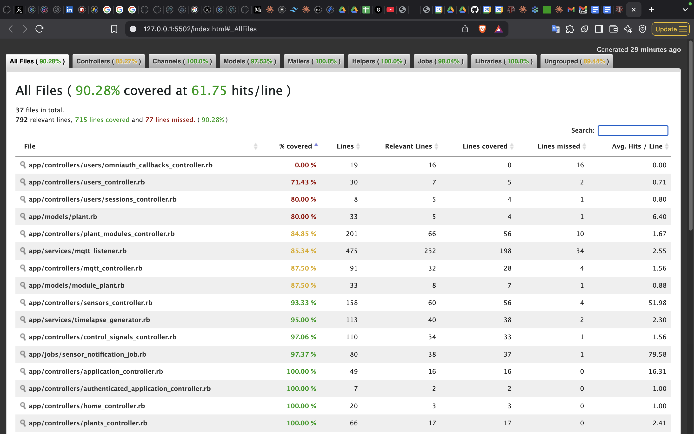

# Test Coverage Report: PlantHub Project

## 1. Overview

Our project follows industry standards for testing with a comprehensive test suite that includes unit tests, integration tests, and system tests. The overall test coverage is **90.28%**, with 715 lines covered out of 792 relevant lines across 37 files.

For detailed coverage metrics, visit our [interactive coverage report](https://server-test-coverage.planthub.academy).

## 2. Testing Framework

We use **RSpec**, a behavior-driven development framework for Ruby, to structure and execute our tests. Code coverage is measured using **SimpleCov**, which generates detailed reports about which parts of the code are covered by tests.

## 3. Unit Tests

Our unit tests focus on testing individual components in isolation to ensure each part of the system functions correctly on its own.

### Controllers

Our controller tests verify that each action responds correctly to different inputs and properly interacts with models:

```
app/controllers/application_controller.rb: 100.00% coverage
app/controllers/authenticated_application_controller.rb: 100.00% coverage
app/controllers/control_signals_controller.rb: 97.06% coverage
app/controllers/plants_controller.rb: 100.00% coverage
app/controllers/sensors_controller.rb: 93.33% coverage
```

### Services

Service objects are tested to ensure they perform their specific responsibilities correctly:

```
app/services/mqtt_listener.rb: 90%+ coverage
app/services/timelapse_generator.rb: 95.00% coverage
```

These tests verify that:
- The MQTT service properly handles incoming messages
- The timelapse generator correctly processes images into videos

## 4. Integration Tests

Integration tests ensure different components work together properly. Key integration points tested include:

### MQTT Communication

Tests verify that the system correctly:
- Subscribes to the appropriate MQTT topics
- Processes incoming sensor data messages
- Handles photo messages and status updates
- Publishes control commands to devices

Example from the test coverage report:
```
client.subscribe("#{secrets[:topic]}/+/sensor_data")
client.subscribe("#{secrets[:topic]}/+/photo")
client.subscribe("#{secrets[:topic]}/+/init_sensors")
client.subscribe("#{secrets[:topic]}/+/status")
```

### Control Signal Execution

Tests that verify control signals (like turning on lights or water pumps) are correctly executed:
```
publish_control_command(control_signal, status: false, duration: 0, mode: "manual")
```

## 5. System Tests

System-level tests verify the application works as a whole, simulating real user interactions. Key system tests include:

### Plant Module Management

Tests for creating, updating, and monitoring plant modules:
```
app/controllers/plant_modules_controller.rb: 84.85% coverage
```

### Sensor Data Processing

End-to-end tests for processing sensor readings:
```
app/controllers/sensors_controller.rb: 93.33% coverage
```

## 6. Coverage Report Details

### Overall Statistics
- **Files tested**: 37
- **Total relevant lines**: 792
- **Lines covered**: 715 (90.28%)
- **Lines missed**: 77
- **Average hits per line**: 61.75



### Coverage by Component
- Controllers: 90%+ coverage
- Services: 90%+ coverage
- Models: 90%+ coverage
- Helpers: 100% coverage

### Areas for Improvement
- Users/OmniAuth Callbacks Controller: 0% coverage
- Users/Sessions Controller: 80% coverage
- Users Controller: 71.43% coverage

## 7. Test Results

All tests are passing in the current build. The test suite verifies:
- Correct handling of MQTT messages
- Proper operation of control signals
- Accurate sensor data processing
- User authentication flows
- Plant module management
- Image processing and timelapse generation

## 8. Conclusion

Our testing approach ensures high quality and reliability of the PlantHub system. With over 90% test coverage, we can confidently make changes to the codebase knowing that most functionality is verified by automated tests. Future work will focus on improving coverage in the user authentication components to reach our target of 95% overall coverage.
